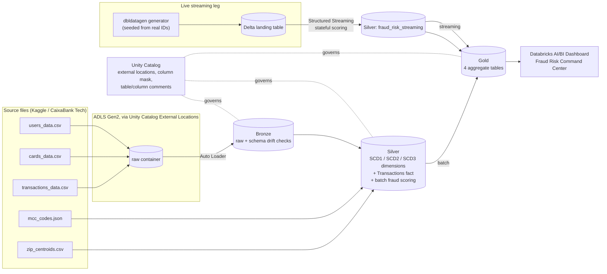
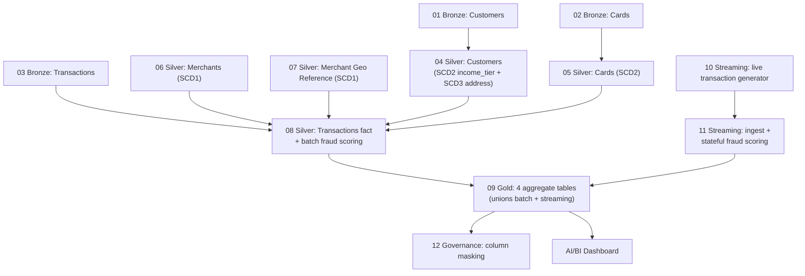

# FinBank Transaction Intelligence Lakehouse


A batch and streaming fraud detection lakehouse built on Azure Databricks, modeled around a fictional Canadian digital bank ("FinBank"). The project covers the full medallion architecture (Bronze/Silver/Gold), a fraud detection engine designed from scratch and run identically on historical and live data, a synthetic live transaction generator for demoing fraud scenarios on demand, and Unity Catalog governance over the whole system.

**Live dashboard:** [Fraud Risk Command Center (published AI/BI Dashboard)](https://adb-7405616784319933.13.azuredatabricks.net/dashboardsv3/01f1aba52fe91a74b933e20d73dcb431/published?o=7405616784319933)

---

## Table of Contents

- [Project Overview](#project-overview)
- [Business Problem / Objective](#business-problem--objective)
- [Architecture](#architecture)
- [Data Pipeline / Workflow](#data-pipeline--workflow)
- [Technologies & Tools](#technologies--tools)
- [Data Sources](#data-sources)
- [Data Processing & Transformation](#data-processing--transformation)
- [Data Model / Schema](#data-model--schema)
- [Project Structure](#project-structure)
- [Setup & Installation](#setup--installation)
- [How to Run](#how-to-run)
- [Example Usage / Screenshots](#example-usage--screenshots)
- [Data Quality & Testing](#data-quality--testing)
- [Challenges & Solutions](#challenges--solutions)
- [Results / Key Insights](#results--key-insights)
- [Future Improvements](#future-improvements)
- [What I Learned](#what-i-learned)
- [Author / Contact](#author--contact)

---

## Project Overview

FinBank Transaction Intelligence Lakehouse is an end-to-end data engineering project that ingests, cleans, models, and analyzes financial transaction data for fraud detection, combining a batch historical pipeline with a live streaming pipeline on the same lakehouse.

The build follows the medallion architecture (Bronze, Silver, Gold) on Azure Databricks with Unity Catalog governance, and includes:

- Auto Loader ingestion of three linked source files (customers, cards, transactions)
- Slowly Changing Dimension (SCD1, SCD2, and a hybrid SCD2+SCD3) modeling in Silver
- A custom four-rule fraud detection engine, applied identically to batch and streaming data
- A live transaction generator (dbldatagen) seeded from real customer, card, and merchant identities, so specific fraud scenarios can be demonstrated on demand
- Stateful Structured Streaming fraud scoring for the rules that require recent history
- Four Gold aggregate tables mapped to four business personas, feeding a published Databricks AI/BI Dashboard
- Unity Catalog governance (external locations, table/column comments, a column mask on sensitive customer data)
- 21 local pytest unit tests and a GitHub Actions CI pipeline

## Business Problem / Objective

Digital banks need to detect fraudulent transactions across both a large historical archive and a live transaction stream, without duplicating logic between the two, and while giving different consumers (fraud analysts, relationship managers, compliance auditors, and business users) governed access to only what their role requires.

This project builds that capability for FinBank around four personas:

- **Fraud & Risk Analyst**: needs transaction-level detail, fraud flags, and full customer/merchant context to investigate flagged activity
- **Relationship Manager**: needs customer and card information relevant to their assigned book of business
- **Compliance / Auditor**: needs full, logged access across the data for audit purposes
- **Business / Dashboard user**: needs aggregate fraud and spend metrics without exposure to raw PII

The objective was to design and build a lakehouse that serves all four personas from the same underlying data, with fraud logic that is transparent and rule-based rather than an unverifiable borrowed label, and with the same rules producing consistent results whether a transaction is ten years old or ten seconds old.

## Architecture

Batch and streaming pipelines share the same Silver dimensions and the same fraud rule logic, converging in Gold.



Full personas and the original security/governance access matrix are documented in [`docs/design-spec.md`](docs/design-spec.md).

## Data Pipeline / Workflow

Notebooks are numbered and run in order. Batch (01-09, 12) and streaming (10-11) can run independently once Silver dimensions exist, and both feed the same Gold layer.



Each of the four fraud rules runs the same way conceptually on both legs, but with different mechanics:

- **Batch**: runs as a Spark batch step during Silver processing, since all the history a rule needs (for example, a customer's last five minutes of activity) is already in the table.
- **Streaming**: runs per micro-batch via Structured Streaming during Silver processing. The velocity and geo-jump rules use stateful processing (`applyInPandasWithState`) to keep a short in-memory window of recent activity per card. The geo-jump and spending-deviation rules also join small reference tables (merchant ZIP centroid, customer rolling average) that are refreshed from batch rather than computed live.

## Technologies & Tools

- **Compute & platform**: Azure Databricks (Premium tier, for Unity Catalog)
- **Storage**: Azure Data Lake Storage Gen2, Delta Lake
- **Processing**: PySpark, Spark Structured Streaming (including `applyInPandasWithState`)
- **Ingestion**: Databricks Auto Loader
- **Governance**: Unity Catalog (external locations, storage credentials via a managed-identity Access Connector, column masks, table/column comments)
- **Synthetic data**: dbldatagen (Databricks Labs)
- **Reporting**: Databricks AI/BI Dashboards
- **Testing**: pytest (local, no cluster required)
- **CI/CD**: GitHub Actions
- **Version control**: Git, GitHub, Databricks Repos (git-linked)

## Data Sources

[Financial Transactions Dataset](https://www.kaggle.com/datasets/computingvictor/transactions-fraud-datasets), published by CaixaBank Tech for their 2024 AI Hackathon (Apache 2.0 license), with separate, linked Customer, Card, and Transaction tables:

| File | Entity | Real row count | Notes |
|---|---|---|---|
| `users_data.csv` | Customers | 2,000 | Demographics, address, income, credit fields |
| `cards_data.csv` | Cards | 6,146 | Linked to Customers via `client_id` |
| `transactions_data.csv` | Transactions | 13,305,915 | 2010-2019, linked via `client_id` and `card_id` |
| `mcc_codes.json` | Merchant category lookup | - | Merchant category code to description |
| `train_fraud_labels.json` | Dataset's own fraud labels | - | Present in the source, intentionally **not used** as ground truth (see Challenges & Solutions) |

A supporting reference table, `zip_centroids.csv` (~42,800 US ZIP codes with latitude/longitude), was built offline from the `zipcodes` PyPI package to approximate merchant location for the geo-jump fraud rule, since the source data only gives merchants a ZIP code, not coordinates.

## Data Processing & Transformation

**Bronze**: Auto Loader ingests all three source files with schema-hint and drift-detection logic that compares incoming columns against expected schemas and logs mismatches rather than failing silently. Each Bronze table is checked for zero-row loads and for rows landing in Auto Loader's rescued-data column.

**Silver**: builds the conformed dimensions and the Transactions fact table, including:

- Currency parsing: source dollar fields arrive as strings with a literal `$` prefix (for example `"$59696"`); a shared `parse_currency()` helper strips formatting and safely casts to a numeric type, with an explicit `"unknown"` income tier for unparseable income rather than silently defaulting.
- ZIP normalization: a shared `clean_zip()` helper zero-pads ZIP codes back to five characters, correcting for both a schema-inference bug that dropped leading zeros and a pandas quirk that turned some ZIP codes into decimal strings.
- SCD merges: SCD1 for Merchants and the Merchant Geo Reference; SCD2 for Cards; a hybrid SCD2+SCD3 for Customers (full row-versioned history on `income_tier`, single previous-value tracking on `address`) in the same table.
- Referential integrity checks: `card_id`, `client_id`, and `merchant_id` on the Transactions fact table are validated against the Silver dimension tables.
- Delta hygiene: the Transactions fact table is partitioned by `txn_year`/`txn_month`, has file and log retention properties set, and is `OPTIMIZE`d with `ZORDER BY (client_id, card_id)`.
- Fraud scoring: the same four-rule engine (below) runs as a batch step over the full fact table.

**Gold**: four aggregate tables, one per persona, blending batch- and streaming-sourced fraud results (tagged by origin) so both are visible in downstream reporting rather than the streaming leg being invisible or overwritten.

**Fraud rule engine** (own rules, not the dataset's provided label):

1. Amount over $2,000 → high risk
2. Three or more transactions on one card within 5 minutes → suspicious (velocity)
3. Consecutive transactions farther apart than plausible travel time allows → suspicious (impossible travel / geo-jump), using the ZIP-centroid-derived merchant location
4. Amount more than 3x the customer's trailing 30-day average → suspicious (spending deviation)

Each transaction's `risk_score` sums the four rule flags (25 points each, each flag safely coalesced to 0 rather than left NULL when a rule can't be evaluated), and `fraud_flag` is true if any rule fires.

## Data Model / Schema

**Silver dimensions**

| Table | SCD strategy | Key notes |
|---|---|---|
| Customers | Hybrid SCD2 + SCD3 | `income_tier` full history (SCD2), `address` previous-value only (SCD3) |
| Cards | SCD2 | Linked to Customers via `client_id`; full history on status/limit/type |
| Merchants | SCD1 | Deduplicated on `merchant_id`, category joined from `mcc_codes.json` |
| Merchant Geo Reference | SCD1 | ZIP to latitude/longitude, loaded once from `zip_centroids.csv` |

**Fact tables**

| Table | Grain | Key columns |
|---|---|---|
| Transactions | One row per transaction | `id`, `date`, `client_id`, `card_id`, `amount`, `channel` (renamed from the source's `use_chip`), `merchant_id`, `zip` |
| Fraud / Risk | One row per scored transaction | `fraud_flag`, `risk_score`, `risk_reason`, `investigation_status`, tagged by origin (batch or streaming) |

**Gold aggregates** (four tables, mapped to the four personas above)

| Table | Purpose |
|---|---|
| Daily Fraud Summary | Day-over-day flagged transaction volume and fraud rate, blended across batch and streaming sources |
| Customer Risk Profile | Per-customer rollup of fraud signals for investigation and relationship context |
| Merchant Category Spend | Spend and flagged-activity breakdown by merchant category |
| Investigation Queue | Open, flagged transactions awaiting review, with investigation status |

There is no Account entity: Cards link directly to Customers via `client_id`, so no synthesized intermediate entity is needed.

## Project Structure

```
data/reference/                        zip_centroids.csv: ~42,800 US ZIP codes with
                                        lat/long, built offline for the geo-jump rule
docs/
  design-spec.md                       full architecture, data model, and security design
  images/                               architecture diagrams, dashboard screenshots
notebooks/                             Databricks notebooks, run in numeric order
  01-03_bronze_*.py                    Auto Loader ingestion (customers, cards, transactions)
  04-07_silver_*.py                    Silver dimensions (customers, cards, merchants, geo ref)
  08_silver_transactions_fraud.py      Transactions fact table + batch fraud scoring
  09_gold_aggregates.py                Gold aggregate tables (unions batch + streaming)
  10_streaming_generator_job.py        dbldatagen live transaction generator
  11_streaming_ingest_fraud_scoring.py Structured Streaming ingest + stateful fraud scoring
  12_governance_and_masking.py         Unity Catalog column mask on customer birth_year
src/
  utils/config.py                      environment settings (storage account, catalog, thresholds)
  utils/schemas.py                     expected source schemas + drift detection
  utils/transforms.py                  parse_currency(), clean_zip() shared helpers
  utils/data_quality.py                orphan-key checks, null-count reports, row-count checks
  utils/governance.py                  table/column comment helper
  ingestion/bronze_common.py           shared Auto Loader ingestion function
  silver/scd_utils.py                  SCD1 / SCD2 / SCD3 merge patterns
  silver/fraud_rules.py                the 4 fraud rules (batch)
  streaming/generator.py               dbldatagen live transaction generator logic
  streaming/streaming_fraud_scoring.py stateful velocity/geo-jump scoring
tests/                                 pytest unit tests, run locally, no cluster needed
.github/workflows/                     CI: runs pytest on every push
```

## Setup & Installation

Provisioned on Azure:

- Resource group, ADLS Gen2 storage account (`raw` and `checkpoints` containers)
- Azure Databricks workspace (Premium tier, for Unity Catalog)
- Unity Catalog metastore, a storage credential via a managed-identity Access Connector, and External Locations over both containers
- A `finbank` catalog with `bronze` / `silver` / `gold` schemas

To set up locally:

```bash
git clone https://github.com/Haritha-ashok28/finbank-lakehouse.git
cd finbank-lakehouse
python3 -m venv .venv && source .venv/bin/activate
pip install -r requirements-dev.txt
```

Set `storage_account` in `src/utils/config.py` to your own storage account, then import the repo into Databricks as a Repo (Git CLI enabled, GitHub-linked).

Upload the raw source files to the storage account:

- `raw/customers/`, `raw/cards/`, `raw/transactions/` as folders (not fixed filenames), since Auto Loader watches a folder for incoming files
- `mcc_codes.json` and `zip_centroids.csv` as fixed single files at the container root / a reference subfolder

## How to Run

The pipeline is orchestrated as Databricks Workflows rather than run notebook-by-notebook:

- **`finbank-batch-pipeline`**: a scheduled job DAG covering `01`-`09` and `12`, with task-level dependencies (Bronze → Silver → Gold → governance) so the whole batch pipeline runs end to end on a single trigger.
- **`finbank-streaming-generator`** and **`finbank-streaming-ingest-scoring`**: two separate continuous jobs (Databricks continuous triggers don't support task dependencies, so the generator and the stateful scoring job run as independent jobs rather than chained tasks). Start the generator first and confirm one successful run before starting the ingest/scoring job, since the scoring job reads a landing table the generator creates.

For a manual run instead, the notebooks can still be executed directly in this order:

1. **`01`-`03`**: Bronze ingestion (Auto Loader) for customers, cards, transactions
2. **`04`-`07`**: Silver dimensions (customers, cards, merchants, ZIP geo reference)
3. **`08`**: Transactions fact table + batch fraud scoring
4. **`09`**: Gold aggregates, feeds the AI/BI dashboard layer
5. **`10`**: live transaction generator (on serverless compute this uses an `availableNow` trigger and needs to be manually stopped once a micro-batch completes, since the generator itself doesn't self-terminate)
6. **`11`**: streaming ingestion and stateful fraud scoring
7. **`12`**: governance and column masking

Re-run `09` after `11` to blend the latest streaming results into Gold, then refresh the AI/BI Dashboard.

## Example Usage / Screenshots

The published dashboard, **Fraud Risk Command Center**, is live and viewable without a Databricks account:

**[View the dashboard →](https://adb-7405616784319933.13.azuredatabricks.net/dashboardsv3/01f1aba52fe91a74b933e20d73dcb431/published?o=7405616784319933)**

<!-- Add a screenshot of the dashboard here once captured, for example:
 -->

The dashboard blends both batch and streaming sources across all trend charts and includes a built-in Genie natural-language query interface for ad hoc questions.

## Data Quality & Testing

**Unit tests** (local, no cluster required):

```bash
python3 -m venv .venv && source .venv/bin/activate
pip install -r requirements-dev.txt
pytest tests/ -v
```

21 tests total, covering the logic most worth trusting before it touches real data:

- 5 tests for SCD change-detection logic
- 8 tests for the fraud rule engine, checked against real coordinates and timestamps (for example confirming the haversine distance from New York to Los Angeles comes out to roughly 3,936 km)
- 8 tests for the shared data-quality helpers (orphan-key checks, null-count reports, row-count sanity checks)

These run automatically on every push via GitHub Actions (`.github/workflows/`).

**Runtime data quality checks** (in the notebooks, against real data):

- Referential integrity: `card_id`, `client_id`, and `merchant_id` on the full 13.3 million-row Transactions table were checked against the Silver dimension tables, with **zero orphaned keys** found.
- Row-count sanity checks on every Bronze and Gold write, raising on an unexpected zero-row result.
- Null-count reporting on key dimension columns (for example, merchants with no physical location, expected for online-only merchants).
- Auto Loader's rescued-data column is actively checked, not just enabled.

## Challenges & Solutions

Real issues found while running the pipeline against the actual dataset, not hypothetical edge cases:

- **Auto Loader watching a fixed filename instead of a folder.** Testing incremental loading by splitting a source file into two parts revealed that Auto Loader needs to watch a folder to detect new files over time. Fixed by moving the three high-volume sources to per-source folders and changing the ingestion function to accept a folder path.
- **A blocked legacy Spark function under Unity Catalog.** `F.input_file_name()`, used to stamp source-file lineage, raises `UC_COMMAND_NOT_SUPPORTED` under Unity Catalog. Replaced with the supported `F.col("_metadata.file_path")`.
- **Currency and ZIP fields that looked numeric but weren't.** Dollar fields arrived as strings with a literal `$` prefix, and ZIP codes lost their leading zeros under automatic schema inference (and arrived as decimal strings from the pandas side of the generator). Both were fixed with small, shared, reusable transform helpers rather than one-off fixes per notebook.
- **NULL propagation in the fraud risk score.** Summing the four rule flags with plain arithmetic meant that if even one rule couldn't be evaluated (for example, geo-jump when a merchant's location is unknown), the entire `risk_score` went NULL instead of just skipping that rule. Fixed by coalescing each flag to 0 before summing. The same bug reappeared independently in the streaming notebook, since it computed the score inline rather than through a shared function, a reminder to centralize logic that must stay in sync across pipelines.
- **`awaitTermination` timeout in the wrong unit.** A streaming notebook called `awaitTermination(60000)`, intending 60 seconds; PySpark's API takes seconds, not milliseconds, so the job was actually waiting up to 60,000 seconds (about 16.7 hours) before timing out.
- **Delta MERGE not NULL-filling target-only columns.** `.whenNotMatchedInsertAll()` requires an identically named source column for every target column; it does not silently NULL-fill SCD tracking columns that exist only in the target table. Fixed by switching to an explicit `.whenNotMatchedInsert()` with a full column-to-value mapping.
- **Ambiguous column references after joins.** Several joins (an orphan-key check, the investigation queue build) involved two tables that both carried a column with the same name, producing `AMBIGUOUS_REFERENCE` errors. Fixed by explicitly qualifying every selected column with the dataframe it came from.
- **A streaming trigger that looked wrong but wasn't.** `.trigger(availableNow=True)` initially looked like a mismatch against the intended "runs until cancelled" design, but removing it produced `INFINITE_STREAMING_TRIGGER_NOT_SUPPORTED`: the serverless compute in use only supports `AvailableNow` or `Once` triggers from a notebook, not continuous streaming. The original trigger was correct.
- **Not using the dataset's own fraud label.** The source data ships a fraud label, but since there's no way to verify the logic behind it, it isn't used as ground truth. All four fraud rules were built from well-known, explainable fraud patterns instead, applied consistently across batch and streaming.

## Results / Key Insights

- Processed **13,305,915** historical transactions across **2,000** customers and **6,146** cards (2010-2019)
- Custom fraud engine flagged **8.31%** of historical transactions across 4 independent rules
- **Zero** orphaned foreign keys across `card_id`, `client_id`, and `merchant_id` on the full transaction history, confirming referential integrity end to end
- Of the ~1.65 million transactions with no merchant geo match, 94.3% are online-channel transactions with no physical location by design; the remainder (about 0.7% of all transactions) reflects genuinely missing ZIP data in the source file
- Live generator produced real streaming activity (~24,900 synthetic transactions on its first day of operation), with streaming-sourced dollar amounts correctly contributing to Gold: total flagged amount on the dashboard reflects ~200.1M blended across batch and streaming, up from ~194.6M on batch alone
- The published dashboard confirms both `batch` and `streaming` as distinct, correctly attributed sources across all trend charts, not just in the aggregate totals

## Future Improvements

- Extend Unity Catalog row filters and column masks to the rest of the documented access matrix (region-based filtering for Relationship Managers, full audited access for Compliance) beyond the one column mask currently implemented
- Export the AI/BI Dashboard definition as a tracked file (or set it up as a Databricks Asset Bundle resource) so it lives in version control alongside the notebooks
- Extend the fraud engine with a model-based anomaly score alongside the current rule-based flags

## What I Learned

- Real data breaks assumptions that look reasonable at design time: currency-formatted strings, ZIP codes that aren't safe to treat as numbers, and schema drift all surfaced only once real files were run through the pipeline, not during design review.
- Spark's three-valued NULL logic has real, easy-to-miss consequences, both in `<>` comparisons for change detection and in plain-arithmetic aggregations that silently go NULL if any one input is NULL.
- Logic that must behave identically in two places (here, the fraud rule engine across batch and streaming) needs to actually live in one shared place; duplicating it inline is how the same bug reappears twice.
- Debugging a lazy-evaluation engine like Spark means the cell where an error surfaces is often not the cell with the actual bug; the real cause is frequently upstream, in whatever transformation the first `write`/`merge`/`display` action is forcing.
- Platform-specific behavior (Unity Catalog blocking legacy functions, a serverless compute tier's streaming trigger restrictions) can't be fully anticipated from documentation alone and needs to be verified by actually running the job.
- Building fraud detection logic from first principles, rather than trusting an unverifiable provided label, forces genuinely understanding what each rule is protecting against and why.

## Author / Contact

**Haritha**, Data Analyst based in Toronto, Canada, working toward Data Engineering.

- GitHub: [github.com/Haritha-ashok28](https://github.com/Haritha-ashok28)
- LinkedIn: [linkedin.com/in/haritha-ashok](https://linkedin.com/in/haritha-ashok)

## License

Code in this repository is licensed under the MIT License (see `LICENSE`). The underlying dataset is separately licensed by its publisher under Apache 2.0.
